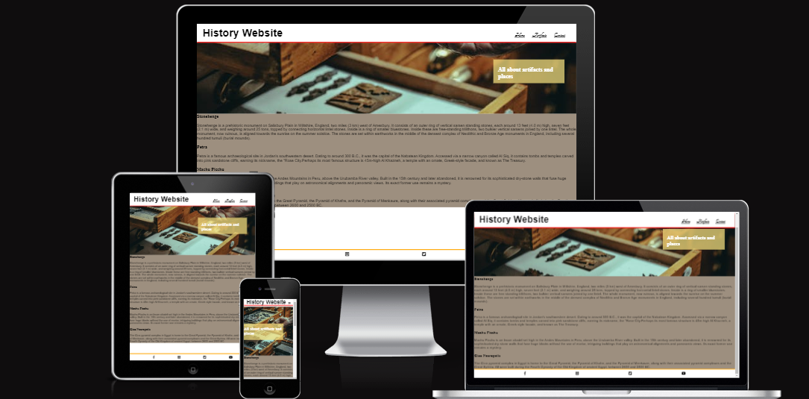
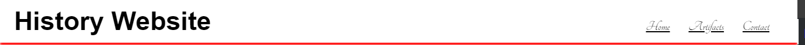
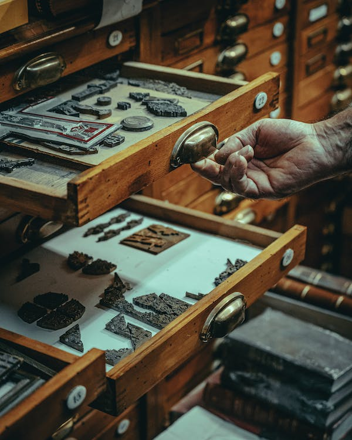
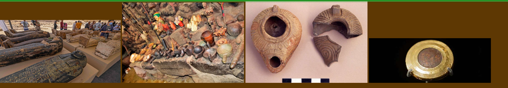
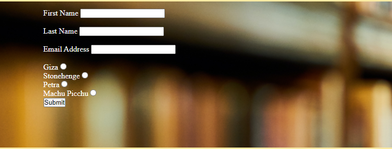
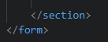
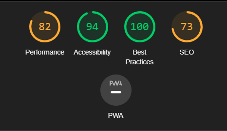

# History Website

The History Website is for all people who are intrested on learning about old artifact and places all over the globe. 
Users who are pasiotated about history, on our website you can find all the details about old artifacts founded on our planet, places from the anciets, contact us if you found old atifact or you want to learn more about histoy, aftifacts and places.

## User Stories

- As a casual user, I want a user-friendly search feature, so I can quickly find information about specific historical figures, events, or locations.
- As a user, I want the website to be responsive and mobile-friendly, so I can access historical content on various devices, including smartphones and tablets.
- As a social media user, I want to be able to share interesting historical articles and facts on my social platforms directly from the website, so I can engage with my friends and followers.

## Features

 ### Existing features:
<ol>
<li>Navigation bar</li>
  
  <ul>
  <li>On the top right of the page we have tree nagivation links: HOME, ARTIFACTS, CONTACT US.</li>
  <li>On the top left we have the name of the webiste. HISTORY WEBSITE.
    The tree link on the top right tells how to navigate in the easy way throw the site</li>
    </ul>
 
 <li>Header</li>
  <ul>
  <li>The header shows the name of the website</li>
  <li>In the header we have a picture for history fans with artifacts</li>
  </ul>
  
  <li>The Artifact Page</li>
  
  <ul>
  <li>On the artifact section we can find photos with artifacts from the five locations showed on the website.</li>
  </ul>
  <li>Contact Us Section</li>
  <ul>
  <li>In the contact us section we have a from with reqired fild to be filled out if you want to know more about our artifacts and places.</li>
  <li>Also we have a nice picture on the contact us page with beautiful contrast.</li>
  </ul>
  
  <li>Footer</li>
  <ul>
  <li>At the bottom of the page we have four links to our social media page.</li>
  </ul>
   
  
  
  ## Testing
  <ul>
  <li>I tested that the website works on other browser: Chrome, Fire Fox, Microsoft Edge. </li>
  <li>I confirm that in the contact us section all the filled and submit button woks.</li>
  <li>On the header, navigation bar have a nice contrast to be readable and all 3 option works.</li>
  <li>I have tested the site in devtools and debugging with CodeAnywhere. </li>
  </ul>
  
  
  ## Bugs
  
  ### Solved Bugs
  <ul>
  <li>Whem i tested the code a error pop out saying i have the forma and section withou closing tag.</li>
  <li>After checking the code again i have found the form closing tag was after section closing tag.</li>
  
  <li>Swaping they're position the bug was fixed.</li>
  </ul>
  
  ## Validator Testing
  <ul>
  <li>HTML</li>
    <ul><li>Using the official W3C validator no errorr was found.</li></ul>
  <li>CSS</li>
    <ul><li>Using the official Jigsaw validator no errors was found.</li></ul>
  <li>Accessibility</li>
  <ul><li>By running the lighthouse in devtools the color and fonts are easy to read.</li></ul>
  </ul>
  

  ## Test Cases
   - ### Home Page:
        - On the home page i have tested that all 3 buttons from nav bar are working, if we press on one of them, automaticly we are redirected to the page selected.
        - On the footer i have pressed on all the 4 link to social media to check if they are working.
   

 - ### Artifact Page:
      - On the artifact page i have test that all images are loading.
  
 

-  ### Contact page:
  
    - On the contact page i have tested that the form user need to write his details all filds are required, the places buttons are working, the form cannot be submitted if all the fields are not completed corectly. If all fields are completed correctly the confirmation page load.
   ## Unfixed Bugs
  <ul><li>No unfixed bugs founded</li></ul>

  ## Deployment
   - ### GitHub:
        - We have deployed the site to GitHub
        - On the GitHub Page head to Setting
        - From the drop-down menu head to Mster Branch
        - After master branch has been selected, the page will provide the link to website.
    [Click here for the link.](https://github.com/BogdanP17/History-website)
  - ### CodeAnywhere:
    - We have writeh the code for all the project, all 3 pages ( Index.html, artifacts.html, contactus.html)
     - On codeanywhere we have deployed live the code by writing on the terminal " python3 -m https.server" so we can see how site looks like.
  ## Technology:
 - HTML for to write the code.
 - Css to style the pages.
 - GitHub to hoist the site.

 ## Future Features:
  - After the user insert they details on the contact us page we would like to send them a confirmation emial.  
  ## Content
  <ul>
  <li>For the social media links to work we used the links from Love Ruuning Project.</li>
  </ul>

## Credits
 
- ### Images and Visual Content:
  - The media images was taken from [Pexels](<https://www.pexels.com/>) and Google.

- ### Text Content:
   - The text content use was found on [Wikipeida](https://wikipeida.com/).
